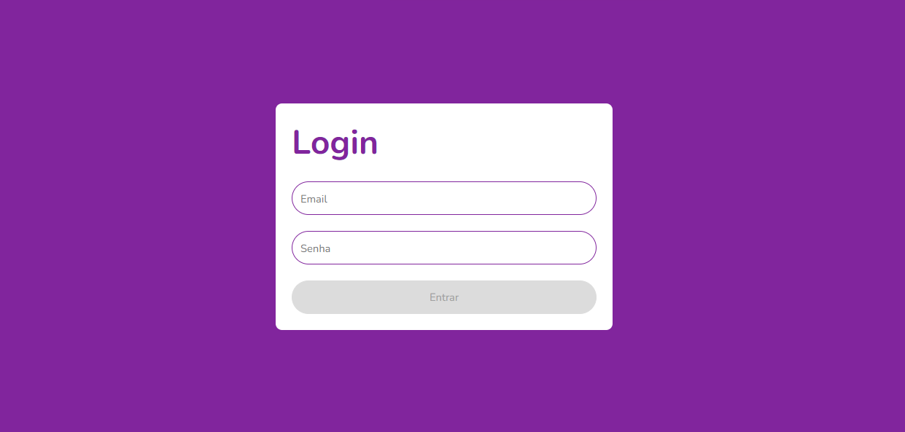

# Login Page

<div align="center">
  
</div>

Este projeto é uma página de login desenvolvida em React que valida os campos de entrada e controla o estado do botão de envio com base na validade do formulário.

## Funcionalidades

- **Validação de Campos**: Verifica se os campos de email e senha estão preenchidos e válidos.
- **Botão Desabilitado**: O botão de login é desativado se o formulário não for válido.
- **Exibição de Mensagens de Erro**: Mostra mensagens de erro se as entradas forem inválidas.

## Tecnologias Usadas

- React
- TypeScript
- JavaScript
- HTML
- CSS

## Instalação

Para executar este projeto localmente, siga os seguintes passos:

1. Clone o repositório:
    ```bash
    git clone https://github.com/JosielJrr/login-page-validation-ts.git
    ```
2. Navegue para o diretório do projeto:
    ```bash
    cd login-page-validation-ts
    ```
3. Instale as dependências:
    ```bash
    npm install
    ```
4. Inicie o servidor de desenvolvimento:
    ```bash
    npm start
    ```

## Scripts Disponíveis

No diretório do projeto, você pode executar:

- `npm start`: Inicia a aplicação em modo de desenvolvimento.
- `npm test`: Executa os testes em modo interativo.
- `npm run build`: Cria uma versão otimizada para produção da aplicação.
- `npm run eject`: Remove as dependências de configuração e permite personalizar o setup (opcional).

## Notas Adicionais

- Este projeto foi desenvolvido como parte do aprendizado de React e validação de formulários usando React Hook Form e Yup.
- Este projeto foi desenvolvido como parte da Formação React Developer da Digital Innovation One.
