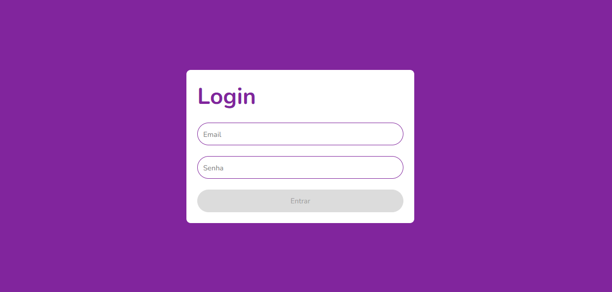

# 🔐 Página de Login

Página de login desenvolvida em React que valida os campos de entrada e controla o estado do botão de envio com base na validade do formulário.

<div align="center">
  
</div>

## ✨ Funcionalidades

- **Validação**: Verifica se os campos de email e senha estão preenchidos e válidos.
- **Botão Desabilitado**: Login só é ativado com formulário válido.
- **Mensagens de erro**: Exibe feedback para entradas inválidas.

## 🛠 Tecnologias Utilizadas

- [React](https://conf.react.dev/)
- [React Hook Form](https://react-hook-form.com/)
- [Yup](https://github.com/jquense/yup)
- [Styled-components](https://styled-components.com/)
- [TypeScript](https://www.typescriptlang.org/)

## ⚙️ Instalação

Para executar este projeto localmente, siga os seguintes passos:

1. Clone o repositório:
   ```bash
   git clone https://github.com/JosielJrr/login-page-validation-ts.git
   cd login-page-validation-ts
   ```
2. Instale as dependências:
   ```bash
   npm install
   ```
3. Inicie o servidor:
   ```bash
   npm start
   ```

> Projeto desenvolvido na **Formação React Developer da [DIO](https://www.dio.me/)**, como parte do aprendizado em validação de formulários com **React Hook Form** e **Yup**.